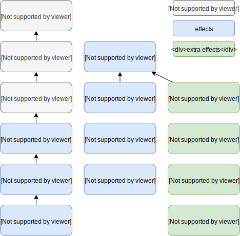

[](https://circleci.com/gh/tmccarthy/bfect)
[](https://repo.maven.apache.org/maven2/au/id/tmm/bfect/bfect-core_2.13/)

# Bfect

A collection of bifunctor effect typeclasses, with instances for ZIO and conversions for cats-effect.

## Project structure

* **`bfect-core`** - A collection of bifunctor effect typeclasses, based loosely around the structure of cats-effect
* **`bfect-testing`** - An implementation of a bifunctor [state monad](https://typelevel.org/cats/datatypes/state.html) along with instances for the `bfect-core` typeclasses
* **`bfect-interop-cats`** - Implicit conversions between the `bfect-core` typeclasses and their analogs in `cats-core` and `cats-effect`
* **`bfect-interop-fs2`** - Utilities for interoperation with [`fs2`](https://github.com/functional-streams-for-scala/fs2/)
* **`bfect-interop-zio`** - Instances of the `bfect-core` typeclasses for the [ZIO IO monad](https://github.com/zio/zio)
* **`bfect-io`** - A half-finished bifunctor IO monad (don't use this)

Each of these are available through [Maven Central](https://repo.maven.apache.org/maven2/au/id/tmm/bfect/), just add them to your project with your favourite build tool.

## Typeclasses



Typeclass | Cats equivalent | Comment |
----------|-----------------|---------|
[`Bifunctor`](core/src/main/scala/au/id/tmm/bfect/Bifunctor.scala) (`BFunctor`) | `cats.Functor`/`cats.Bifunctor` | Functor with `biMap` and its derivations (`map`/`rightMap`, `leftMap`) |
[`BifunctorMonad`](core/src/main/scala/au/id/tmm/bfect/BifunctorMonad.scala) (`BMonad`) | `cats.Monad` | Monad. Adds `flatMap`, `rightPure` and `leftPure`. |
[`BifunctorMonadError`](core/src/main/scala/au/id/tmm/bfect/BifunctorMonadError.scala) (`BME`) | `cats.MonadError` | Represents the ability to handle errors with `handleErrorWith`. Comes with the alias `BME`. |
[`effects.Bracket`](core/src/main/scala/au/id/tmm/bfect/effects/Bracket.scala) | `cats.effect.Bracket` | Bracket. Represents the pure equivalent of `try`/`finally` |
[`effects.Now`](core/src/main/scala/au/id/tmm/bfect/effects/Now.scala) | `cats.effect.Timer` | Represents the ability to create a timestamp |
[`effects.Timer`](core/src/main/scala/au/id/tmm/bfect/effects/Timer.scala) | `cats.effect.Timer` | Extends `Now` with the ability to delay execution for a period of time |
[`effects.Die`](core/src/main/scala/au/id/tmm/bfect/effects/Die.scala) | | Extends `BifunctorMonadError` with the ability to suspend an effect that fails in an unchecked manner |
[`effects.Sync`](core/src/main/scala/au/id/tmm/bfect/effects/Sync.scala) | `cats.effect.Sync` | Extends `Die` with the ability to suspend arbitrary synchronous effects |
[`effects.Async`](core/src/main/scala/au/id/tmm/bfect/effects/Async.scala) | `cats.effect.Async` | Extends `Sync` with the ability to register asynchronous effects |
[`effects.Concurrent`](core/src/main/scala/au/id/tmm/bfect/effects/Concurrent.scala) | `cats.effect.Concurrent` | Represents the effect of starting and cancelling tasks |
[`effects.extra.Console`](core/src/main/scala/au/id/tmm/bfect/effects/extra/Console.scala) | | Represents the effect of writing to the console |
[`effects.extra.EnvVars`](core/src/main/scala/au/id/tmm/bfect/effects/extra/EnvVars.scala) | | Represents the effect of accessing environment variables |
[`effects.extra.Resources`](core/src/main/scala/au/id/tmm/bfect/effects/extra/Resources.scala) | | Represents the effect of accessing Java resources |
[`effects.extra.Calendar`](core/src/main/scala/au/id/tmm/bfect/effects/extra/Calendar.scala) | | Extends `Now` with the ability to determine the system timezone, enabling computation of the local date and so on. |

Note that unlike in cats, `Bracket` and `Concurrent` are not part of the main inheritance chain that includes `Sync` and `Async`

## Usage

Use the following imports:

* `import au.id.tmm.bfect.syntax.all._` for extension methods
* `import au.id.tmm.bfect.instances.all._` for instances
* `import au.id.tmm.bfect.implicits._` for everything

```scala
import au.id.tmm.bfect.effects.Sync
import au.id.tmm.bfect.implicits._

// Companion objects provide static methods:

def hello1[F[_, _] : Sync]: F[Nothing, String] = Sync[F].pure("hello")
def hello2[F[_, _] : Sync]: F[Nothing, String] = Sync.pure("hello")

def print1[F[_, _] : Sync](string: String): F[Nothing, Unit] = Sync[F].sync(println(string))
def print2[F[_, _] : Sync](string: String): F[Nothing, Unit] = Sync.sync(println(string))

// Sync.Ops provides instance methods. The following are equivalent:

def printHello1[F[_, _] : Sync]: F[Nothing, Unit] = Sync[F].flatMap(hello1)(print1)
def printHello2[F[_, _] : Sync]: F[Nothing, Unit] = hello1.flatMap(print1)

// Importing Sync.Ops enables for-yield syntax:

def printHello3[F[_, _] : Sync]: F[Nothing, Unit] =
  for {
    hello <- hello1
    _     <- print1(hello)
  } yield ()
```

### Cats interoperation

The `bfect-interop-cats` package provides implicits for interoperation with Cats. This includes instances
for effect types using `EitherT`. The easiest way to access these is with the following import:

```scala
import au.id.tmm.bfect.interop.cats.implicits._
```
